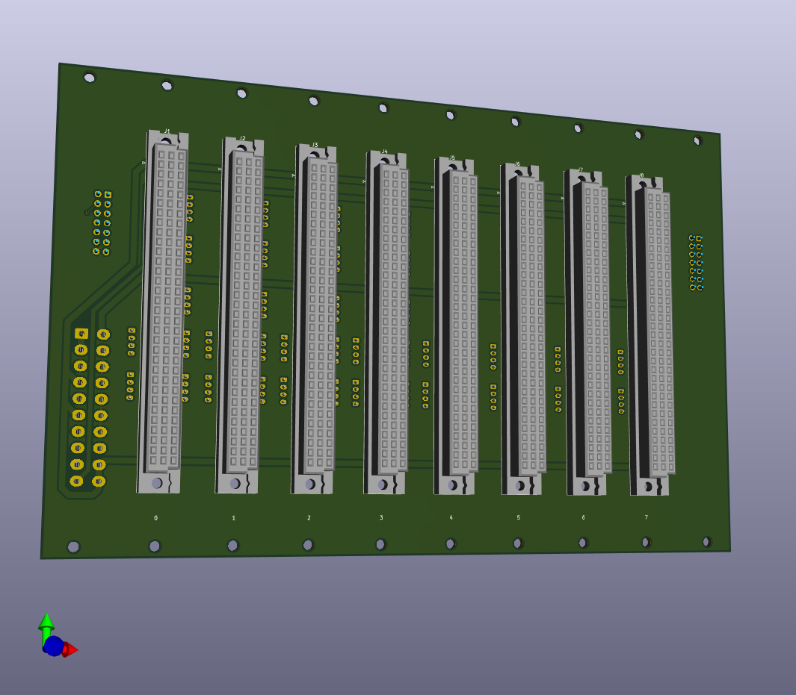
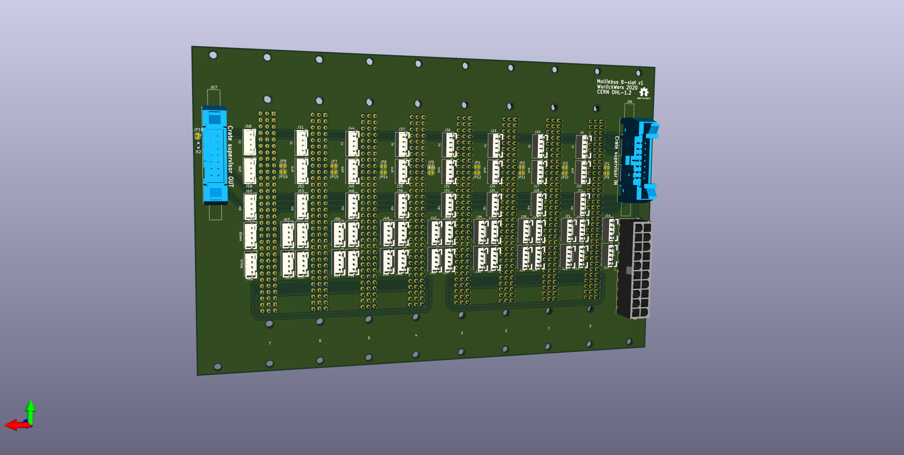

## bus-8

An 8-slot bus, suitable for 4, 4 x 4, and 4 x 4 x 4 node configurations.

See also:
* [schematic](schematic.pdf).
* [layout](layout.pdf).
* [Schroff Design Guide](datasheets/SchroffDesignGuide.pdf) for eurocard
dimensions.
