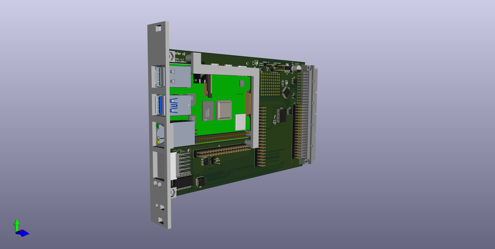

## pi-carrier

This is an early attempt at a cluster compute module using the Raspberry
Pi 4B, integrated into the Eurocard form factor, with remote management
via CAN bus and a 5x7 LED matrix.  A Mezzanine card provides access to Pi
GPIO pins and additional backplane pins.

See also:
* [schematic](schematic.pdf)
