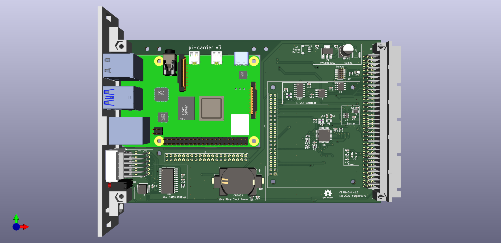

## pi-carrier

This is an early attempt at a cluster compute module using the Raspberry
Pi 4B.

This board uses only the following bus pins:
* Power (5V and GND)
* CAN bus
* Geographic address GA0:4
* RESET~

It implements the following features
* Service processor for remote management
* LED Matrix display
* pi power control
* pi CAN adapter
* pi EEPROM

It does have headers that enable a mezzanine board to connect to some
pi GPIO pins and unused bus pins designated USER13:21, USER23:30,
RSV15:21, RSV23:30.
