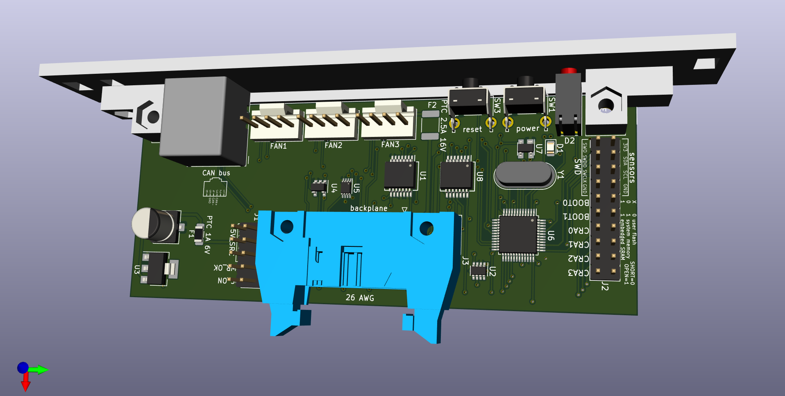
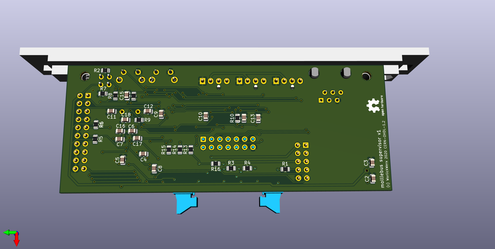

## supervisor

Supervisor card, which attaches to backplane using 14-pin ribbon cable,
and controls reset and power, power up/down.

Front view:

Back view:

See also:
* [schematic](schematic.pdf)
